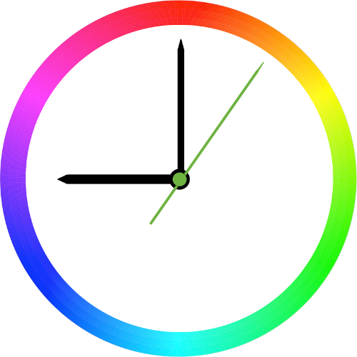

# hass-colorclock
Home Assistant scene component that uses one, two or three lights to show the current hour, minute and second as RGB color.

## The HSV circle

The HSV color circle is used to map the time values into colors.



## Installation

* If it doesn't exist yet, create a sub-folder in your configuration directory called `custom_compoments/scene`
* Download the [colorclock.py](colorclock.py) file and copy it to this sub-folder

## Configuration

Add the following snippet to your `configuration.yaml`, or any file that is included by it:

```
scene:
  - platform: colorclock
    hour_light: light.RGB1
    minute_light: light.RGB2
    second_light: light.RGB3
    angle_offset: 270
    24h_mode: false
    ccw: false
```

`hour_light`, `minute_light` and `second_light` reference light entities in your configuration that have support for RGB values.
All are optional, so you can leave off the ones you don't want.

By default, zero-values are mapped to the top of the circle, so `00:00:00` would map to red on all lights. The optional configuration option
`angle_offset` can be set to a value between 0 and 359 to rotate the circle at your will. So for instance, setting this option to 240 would
turn the lights to blue at midnight.

By setting the optional `24h_mode` boolean variable to `true`, the hour hand will make one full turn in 24 hours rather than in 12 hours.
Setting `ccw` to `true` will make the hands move counter-clockwise.

As scenes are one-shot events in Home Assistant, we also need an automation to trigger an update in regular intervals. The necessary update
frequency depends on whether or not you configured a light to display seconds. If you have, you should update the clock every second of
course. Otherwise, once or twice a minute is enough. Below is an example automation for the update action.

Note that the color of the lights is only changed if the lights are already switched on.

```
automation:
  - alias: Enable color clock
    trigger:
      platform: time
      seconds: '/1'
    action:
      service: scene.turn_on
      entity_id: scene.color_clock
```

## License

GPLv2

